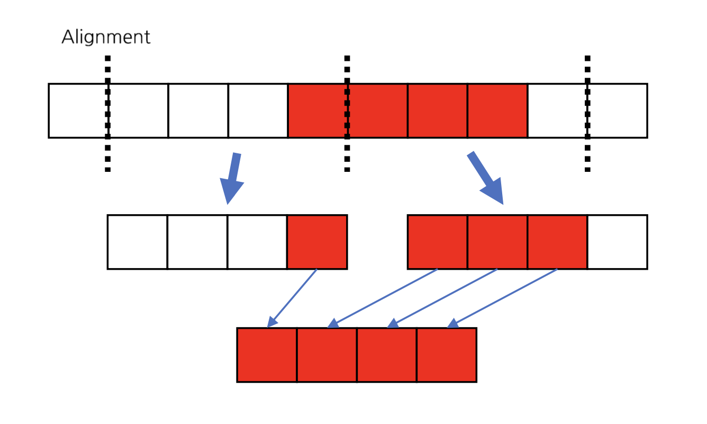

# Matrix multiplication optimization - Nguyen Hoang Thuan

## Introduction

This report focuses on techniques that are optimally applied to the problem of matrix multiplication. The techniques used in the problem will be explained theoretically along with experiments to choose the best combination of methods.

The structure of the report includes 4 main parts:

- Introduction: states the purpose and general content of the report
- Techniques used: overview of the theoretical basis and explanation of the effectiveness of the techniques used in the proposed method
- Experimental results: State the experimental settings along with the results to choose the best method.
  Conclusion: conclusions are drawn after the process of solving the problem

## Techniques used

### Native approach

Matrix multiplication is represented as follows:
Suppose we have matrix `A` of size `(M, K)` and matrix `B` of size `(K, N)`, the result of multiplying matrix `A x B` is represented by matrix `C` of size `(M, N)` where each element `(i, j)` of the matrix `C` is the dot product of the vector row `i` of matrix `A` and vector column `j` of matrix `B`.


This is code example of native approach, this native approach will be used to check the correctness of other optimization methods applied in this report.

```
for (int k = 0; k < K; k++)
    for (int i = 0; i < M; i++)
        for (int j = 0; j < M; j++)
             C[i * N + j] += A[i * K + k] * B[k * N + j];
```

### Matrix Tiling

This approach takes advantage of the computer's cache memory to improve temporal locality and spatial locality when accessing matrix data, because the cache access speed is much higher when accessing main memory, this helps significantly improve calculation speed.

This is example code of Tiling technique, with loop order is `k-i-j` and `T_k`, `T_i` and `T_j` is tile size for each dimension.

```
for (int kk = 0; kk < K; kk += T_k)
    for (int ii = 0; ii < M; ii += T_i)
      for (int jj = 0; jj < N; jj += T_j)
        for (int k = kk; k < std::min(K, kk + T_k); k++)
          for (int i = ii; i < std::min(M, ii + T_i); i++)
            for (int j = jj; j < std::min(N, jj + T_j); j++)
              C[i * N + j] += A[i * K + k] * B[k * N + j];
```

### Loop unrolling

As we know, with the matrix multiplication method above `C[i * N + j] += A[i * K + k] * B[k * N + j];`, each loop is independent and does not depend on the previous loops. In general, each instruction set will consist of 5 cpu cycles in a pipeline as follow:


If two consecutive instructions do not depend on each other, they can be scheduled to run immediately after the end of the first cpu cycle.


Loop unrolling is based on this basis to optimize execution time. Instead of having to wait after the statement is completed to increase variable `i` to access the next element, we can proceed to calculate calculate `n` consecutive elements in the same loop, n will approximate the number of cpu cycles needed to execute an instruction and needs to be adjusted during experimentation, usually `n` will have a value of 4-6 depending on each CPU architecture. Below is an example applying unrolling in matrix multiplication with `n = 4`.

```
for (k = kk; k < limk-3; k += 4)
    for (i = ii; i < limi; i++)
    {
        float a0 = A[i * K + k]  ;
        float a1 = A[i * K + k + 1] ;
        float a2 =  A[i * K + k + 2]  ;
        float a3 =  A[i * K + k + 3]  ;
        for (j = jj; j < limj; j++)
        {
            float b0 =  B[k * N + j] ;
            float b1 =   B[(k + 1) * N + j]  ;
            float b2 =   B[(k + 2) * N + j] ;
            float b3 = B[(k + 3) * N + j] ;
            C[i * N + j] += (a0 * b0 + a1 * b1 + a2 * b2 + a3 * b3);
        }
    }
    
```

### Vectorization (SIMD)

SIMD stands for Single Instruction, Multiple Data - the single instruction perform the same operation in parallel on multiple item of data with the same type and size. With matrix multiplication problem, there is no dependence between 2 consecutive iterations, we can easily vectorize it. Generally, with AVX2 instruction, support 256 bits of register - 8 float or 4 double elements datatype in C/C++.

To take fully advantage of SIMD, we should align data with 32-byte boundary. In case the data is unaligned, it will require more time to find the segments of data in a register then merge.



### Pthread

In the above methods, only one CPU core is used for calculation, while many parts of the matrix can be processed in parallel due to their independence. Therefore, taking advantage of matrix division and performing parallel calculations can help significantly improve calculation speed.

Pthread is a method that can be used to optimize matrix multiplication. This is a lighter version of a process and threads belonging to the same process can share resources (data, memory, virtual memory space, ...) with each other.

To apply pthread to matrix multiplication, we divide the matrix A evenly vertically, each sub-matrix has size M/num_threads. The threads will perform calculations on a sub-matrix in parallel with each other. The main process will wait for all threads to finish calculating to return the results.

When implement parallism with pthread, we need to pin thread with cpu core to make it run faster, then wait all thread to finish and return the result

```
pthread_t tid[_num_threads];
ThreadArg arg[_num_threads];
cpu_set_t cpus[_num_threads];
pthread_attr_t attr[_num_threads];

for (int i = 0; i < _num_threads; i++)
    {
        Set arguments for thread ...

        pthread_attr_init(&attr[i]);
        CPU_ZERO(&cpus[i]);
        CPU_SET(i, &cpus[i]);
        pthread_attr_setaffinity_np(&attr[i], sizeof(cpu_set_t), &cpus[i]);
        pthread_create(&tid[i], &attr[i], mul_thread, &arg[i]);
    }
    for (int i = 0; i < _num_threads; ++i)
        pthread_join(tid[i], NULL);

```

### OpenMP

OpenMP is a set of compiler`s directives, library procedures and environment variables which was developed for creating multi-threading apps for systems with shared memory. OpenMP works just on compilation time — it converts preprocessor directives to native Fortran/C/C++ code which is then compiled to executable. This allows the OpenMP to provide kind of “user friendly” interface without loosing performance in some case. In this report OpenMP also in the experiments.

During implementation step, the `#pragma` is placed in front of tiling `i` loop and I also pin the CPU for each thread run by OpenMP:

```
for (int kk = 0; kk < K; kk += T_k)
#pragma omp parallel for simd num_threads(_num_threads) shared(A, B)

    for (int ii = 0; ii < M; ii += T_i)
    {
        cpu_set_t mask;
        CPU_ZERO(&mask);
        int tid = omp_get_thread_num();
        CPU_SET(tid, &mask);
        sched_setaffinity(0, sizeof(mask), &mask);
        for (int jj = 0; jj < N; jj += T_j){
            ....
        }
    }
```

### Non-Unified Memory Access (NUMA)

A specific memory channels and CPU cores form a NUMA node, for this reason if we can access memory location from the same NUMA node, it will be much faster than remote access.

To apply NUMA need to allocate memory in

### Message Passing Interface (MPI)

Above apporachs use only 1 node to solve the problem. However to take advantage of multi nodes system to solve larger problem, we can do with higher throughput. MPI was designed for distributed memory system with high performance and scalability. In this report, the MPI was used to optimize throughput by parallel process segment of data in 2 node.

To speed up transfort data phase between 2 node, when implementation I use Iscatter to transfer segment of A and Ibcast to transfer B, these 2 method are non-blocking communication, so we can execute both 2 requests and then wait 2 requests are completed and start computing.

```
mpi_world_size = _mpi_world_size;
MPI_Request request[2];          
int sendcounts[_mpi_world_size]; 
int displ[_mpi_world_size];      
for (int i = 0; i < mpi_world_size; i++)
{
    int is = M / _mpi_world_size * i + std::min(i, M % _mpi_world_size);
    int ie = M / _mpi_world_size * (i + 1) + std::min(i + 1, M % _mpi_world_size);
    sendcounts[i] = (ie - is) * K;
    displ[i] = is * K;
}

MPI_Ibcast(B, K * N, MPI_FLOAT, 0, MPI_COMM_WORLD, request);

MPI_Iscatterv(A, sendcounts, displ, MPI_FLOAT, A, M * K / _mpi_world_size,
 MPI_FLOAT, 0, MPI_COMM_WORLD, request + 1);
M = sendcounts[_mpi_rank] / K;
MPI_Request request_result;
MPI_Waitall(2, request, MPI_STATUSES_IGNORE);
mat_mul_pthread(A, B, C, M, N, K, _num_threads, _mpi_rank);
MPI_Igatherv(C, M * N, MPI_FLOAT, C, sendcounts, displ, MPI_FLOAT, 0,
 MPI_COMM_WORLD, &request_result);
MPI_Wait(&request_result, MPI_STATUS_IGNORE);
```

## Experiment result

### GCC optimization flag

GCC optimization flag is optimizer from the compiler level, it will tell the compiler what option will be use to optimize the assembly code.

For all experiment the gcc optimization flags are added contain:

- O3 This flag directs the compiler to be aggressive about the optimization techniques used and to use as much memory as necessary for maximum optimization.
- march=znver2 This is an optimization flag that tell compiler to optimize code for the specific target AMD zen2 CPU.
- mavx2 This option allow compiler to use AVX instruction to to auto-vectorization of loops.
- mfma is an extension to the 128 and 256-bit Streaming SIMD Extensions instructions in the x86 microprocessor instruction set to perform fused multiply–add (FMA) operations.

### Tiling + Unrolling + SIMD

In this section, I do experiment by combine 3 method and modify parameter of Tiling, Unrolling and SIMD. The Tiling will be order by `k-i-j` and `M=N=K` for all experiment. We apply unrolling by `k` axis and monitor result. The test was run 10 times and get the average number


| Tiling (i-j-k) | Unrolling | SIMD |   512   |   1024   |   2048   |   4096   |
| :------------: | :-------: | :--: | :------: | :-------: | :-------: | :-------: |
|  32-1024-1024  |    No    |  No  |  29.01  |   28.12   |   26.93   |   24.82   |
|  32-1024-1024  |     4     |  No  |  63.24  |   60.66   |   58.16   |   54.38   |
|  32-1024-1024  |     4     | Yes |  61.72  |   61.45   |   58.3   |   55.0   |
|  32-1024-1024  |     6     |  No  |  58.39  |   59.52   |   56.55   |   50.49   |
|  32-1024-1024  |     6     | Yes |  70.32  |   66.7   |   61.9   |   59.49   |
|   32-512-512   |     6     | Yes |   70.6   |   63.84   | **62.34** | **62.77** |
|   64-512-512   |     6     | Yes |  71.31  |   65.1   |   60.6   |   60.4   |
|  64-1024-1024  |     6     | Yes |  71.43  | **67.72** |   61.86   |   60.1   |
|   64-512-480   |     6     | Yes | **71.7** |   65.13   |   60.18   |   60.53   |

With above results, we can conclude that, apply unrolling can boost the throughput significantly, more than twice. Aplly SIMD can improve result, but depend on stride of unrolling, with unrolling stride 4, SIMD has slightly affect, but with unrolling stride 6, SIMD can improve more than 15%.

Change different Tile size also help to improve, but not significant.

### Tiling + Unrolling + SIMD + Pthread

Experiment with Pthread will be setup to run with different number of threads, we also apply SIMD and unrolling with stride 6 and experiment different Tile size because when divide the matrix to many thread, the original size change so we also need to observe it.


| Tiling (i-j-k) | #thread |   1024   |    2048    |    4096    |  |
| :------------: | :-----: | :-------: | :--------: | :--------: | :-: |
|   32-512-512   |    8    |   476.5   |   468.1   |   435.3   |  |
|   32-512-512   |   16   |   782.3   |   818.9   |   802.9   |  |
|   32-512-512   |   32   | **834.1** | **1254.1** | **1240.5** |  |
|   32-512-512   |   64   |   649.2   |   790.1   |   763.7   |  |

<!-- | 32-1024-1024| 32 | **865.5**  |  1222.8  | 1176.1  |
| 64-512-512| 32  |  823.6  |  1173.8  | 1132.8  | -->

The number of threads is 32 give the best result, when increase thread to 64 the result decrease significantly. This behavior is caused by the SMT thread in architecture of CPU, the CPU has only 32 real cores and 32 logical cores to form 64 cores architecture. When we can optimize the code and make the cpu take full execution time, increase number of thread >32 doesn't help.

### Tiling + Unrolling + SIMD + OMP

The setup for OpenMP is the same with Pthread.


| Tiling (i-j-k) | #thread |    1024    |    2048    |    4096    |
| :------------: | :-----: | :--------: | :--------: | :--------: |
|   32-512-512   |    8    |   500.3   |   460.8   |   412.7   |
|   32-512-512   |   16   |   874.3   |   820.1   |   702.2   |
|   32-512-512   |   32   | **1339.2** | **1292.1** | **1211.9** |
|   32-512-512   |   64   |   342.2   |   790.1   |   870.6   |

<!-- | 32-1024-1024| 32 |  865.5  |  1222.8  | 1176.1  |
| 64-512-512| 32 | 823.6  |  1173.8  | 1132.8  | -->

Apply OpenMP has slightly better than Pthread.

### Tiling + Unrolling + SIMD + Pthread/OMP + NUMA

This is result when add NUMA optimization on Pthread/ OMP. It using the best mertric setup in above experiment.


| Parralell | #thread |    1024    |    2048    |    4096    |
| :-------: | :-----: | :--------: | :--------: | :--------: |
|  Pthread  |   32   |   708.6   |   1310.8   | **1280.9** |
|    OMP    |   32   | **1364.0** | **1377.4** |   1277.6   |

### Tiling + Unrolling + SIMD + Pthread/OMP + NUMA + MPI


| Parralell |   Tiling   |  1024  |   2048   |   4096   |
| :-------: | :--------: | :-----: | :------: | :------: |
|  Pthread  | 64-512-512 |   780   |   1310   | **2112** |
|  Pthread  | 64-512-480 |   756   |   1287   |   2091   |
|  Pthread  | 32-512-512 |   677   |   1218   |   2071   |
|  Pthread  | 32-512-480 |   754   |   1289   |   2077   |
|    OMP    | 64-512-512 |   538   |   1154   |   2068   |
|    OMP    | 64-512-480 |   570   |   1110   |   2075   |
|    OMP    | 32-512-512 | **969** | **2043** |   2050   |
|    OMP    | 32-512-480 |   775   |   1968   |   2045   |

As we can see from the result, with the matrix have size small < 2048, using MPI + OMP will give much better result. In the other hand, with large matrix size (4096) the parallism using Pthread is slightly better than OMP.

## Conclusion

In this report, the best method achieves **2.1 TFLOPS** with the multiplication of 2 matrices of size `4096x4096` using a combination of Tiling `64-512-512`, Unrolling with stride 6, SIMD, Pthread with 32 threads and MPI. However, when tested on matrices smaller than `2048x2048`, OpenMP produced much better results, almost twice compare to Pthread.
