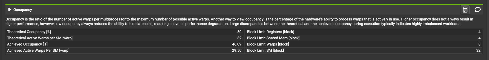
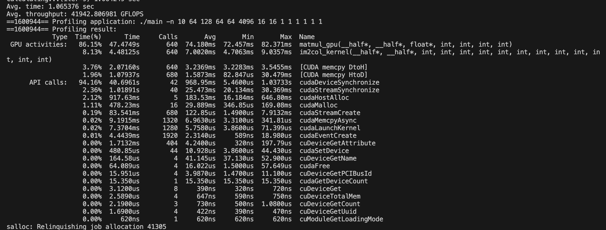

# Convolution GPU - Nguyen Hoang Thuan

## Introduction

In this report, I will generalize the techniques used to perform the convolution problem on nvidia GPUs based on the cuda library. In this report, I will generalize the techniques used to perform the convolution problem on nvidia GPUs based on the cuda library.

## Solution

The algorithm consists of 3 main parts, Im2col, matmul and reshape. In the other hand, to speed up algorithm I also apply double/triple buffer and MPI to run in multiple nodes.

### Im2Col

The Cuda kernel of Im2col is below


total number of threads is `OH x OW x ON` and each thread will copy a matrix size `C x R x S` to the target output.

### Matmul

The matmul is the kernel contains many techniques from the lecture. Some key points is:

- Shared memory between threads inside a block.
- Global Memory Coaleasing.
- Calculate an output 6x6 in the result matrix with 1 thread.

### Reshape

The CPU version of reshape do the memcpy operation which is very time consuming and waste of time. To optimize this part, I proposed a method to merge the reshape layer with the matmul kernel.


We need to reshape from `K x N x OH x OW` to `N x K x OH x OW`, given the current index of target matrix is `idx`, the `new_idx` will be calculated as follow:

```
ohow = idx % (OH*OW);
n = idx / (OH*OW) %N;
k = idx / (OH*OW*N);
new_idx = (n*K +k)*OH*OW +ohow;
C[new_idx] = value;
```

By this way, we can reduce overhead of copy data, especially in the case the matrix C is very large.

### MPI, Multi GPU and buffering

I use MPI to manage nodes in the cluster and each node will create 4 threads, each thread will manage 1 GPU. I also split into to many blocks and create corresponding streams, each stream will do copy data and calculate one part of data.

I split the data by N with MPI, thread and also stream buffer.

## Experiment result

### Profiling with NCU

I run profiling with this problem size

```
srun ncu --set=full -o ncu -f ./main -n1 32 512 64 64 1024 3 3 1 1 1 1 1 1
```




### Profiling with nvprof




When run with 2 nodes the performance reduce dramtically, almost 2 times due to network latency.
